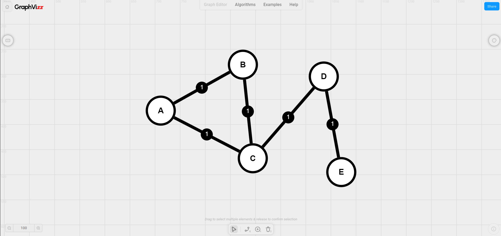
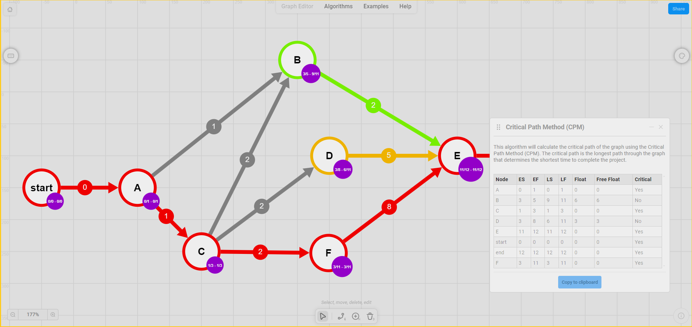

# GraphVizz

This is an online graph visualization tool that allows you to **create**, **edit**, **run algorithms**, and **share** graphs. It is built using React and canvas API.

> 🔗 **Try it now online at**: [GraphVizz.com](https://www.graphvizz.com)

------------------------------------------------------------------------------------

## Features

- 🧩 **Graph add/delete nodes and edges**
  - Create nodes by clicking on the canvas.
  - Create edges by clicking on a node and dragging the mouse to another node (hold `Shift` to create a directed edge).
  - Delete nodes and edges by selecting them and pressing `Delete`.
  - Copy & paste nodes and edges.
- ✏️ **Graph edit**
  - Move nodes by dragging them.
  - Select multiple nodes and edges by dragging the mouse.
- 🎨 **Elements customization**
  - Change multiple elements properties like color, label, etc.
- 🌟 **Live editing**
  - Add or remove nodes from your current graph in the format of an edge list
- ⚙️ **Algorithms**
  - Run algorithms on your graph and see the results.
  - Currently, the following algorithms are available:
    - Breadth First Search (BFS)
    - Depth First Search (DFS)
    - Dijkstra's Algorithm
    - Hamiltonian Cycle
    - Hamiltonian Path
    - Minimum Spanning Tree (MST) (*using Kruskal's Algorithm*)
    - Maximum Spanning Tree (MST) (*using Kruskal's Algorithm*)
    - Chromatic neighbors
    - Nodes degree's
  - Also, auto-arrange your graph using the following algorithms:
    - Circular
    - Grid
    - Tree (using BFS)
    - Tree (using DFS)
    - Random
    - Topological Sort
    - Organic arrangement
    - Random
  - Copy the result of the algorithms to the clipboard.
  - Some algorithms have a *color* view that shows the result of the algorithm.
- 📤 **Import and export graphs**
  - Import graphs from an edge list, JSON file, or a URL. 
  - Export graphs to an edge list or a JSON file or share the graph using a URL.
- 🔧 **Other features**
  - Undo/Redo actions with `Ctrl + Z` and `Ctrl + Y` or `Ctrl + Shift + Z`.

> 🏗️ All the code has been written from scratch, including the algorithms and the graph visualization, the canvas management tools, and the graph management tools.
